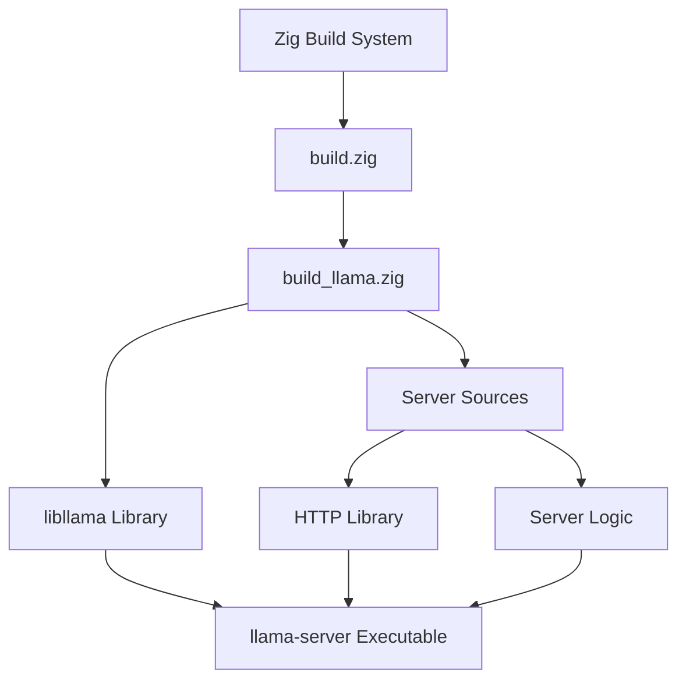

# Building llama-server through Zig

## Overview

This document provides a comprehensive guide for extending the llama.cpp.zig build system to include the llama-server component. This approach allows you to build the full HTTP server using Zig's build system while maintaining the benefits of the Zig ecosystem.

## Architecture



## Prerequisites

- Zig 0.14.x or later
- C++ compiler (GCC, Clang, or MSVC)
- Git submodules initialized (`git submodule update --init --recursive`)
- Model file in GGUF format

## Step-by-Step Implementation

### 1. Analyze Server Dependencies

The llama-server has the following key dependencies:

**Core Dependencies:**
- `libllama` (already built by the Zig system)
- `httplib.h` (HTTP server library)
- `json.hpp` (nlohmann/json for JSON handling)
- Standard C++ libraries

**Source Files:**
- `server.cpp` (main server implementation)
- `utils.hpp` (server utilities)
- Generated HTML assets (`index.html.gz.hpp`, `loading.html.hpp`)

### 2. Extend build_llama.zig

Add server building functionality to `build_llama.zig`:

```zig
// Add to build_llama.zig after the existing functions

pub fn buildServer(ctx: *Context) *CompileStep {
    const b = ctx.b;
    
    // Create server executable
    const server_exe = b.addExecutable(.{
        .name = "llama-server",
        .target = ctx.options.target,
        .optimize = ctx.options.optimize,
    });
    
    // Add include paths
    server_exe.addIncludePath(ctx.path(&.{"include"}));
    server_exe.addIncludePath(ctx.path(&.{"common"}));
    server_exe.addIncludePath(ctx.path(&.{ "ggml", "include" }));
    server_exe.addIncludePath(ctx.path(&.{ "ggml", "src" }));
    server_exe.addIncludePath(ctx.path(&.{ "examples", "server" }));
    
    // Link against libllama
    ctx.link(server_exe);
    
    // Add server source files
    server_exe.addCSourceFile(.{
        .file = ctx.path(&.{ "examples", "server", "server.cpp" }),
        .flags = ctx.flags(),
    });
    
    // Add httplib header (single-header library)
    server_exe.addIncludePath(ctx.path(&.{ "examples", "server" }));
    
    // Generate HTML assets
    const index_html = generateHtmlAsset(b, ctx, "index.html.gz");
    const loading_html = generateHtmlAsset(b, ctx, "loading.html");
    
    // Add generated assets as C++ headers
    server_exe.addCSourceFile(.{
        .file = index_html,
        .flags = ctx.flags(),
    });
    server_exe.addCSourceFile(.{
        .file = loading_html,
        .flags = ctx.flags(),
    });
    
    return server_exe;
}

fn generateHtmlAsset(b: *std.Build, ctx: *Context, filename: []const u8) std.Build.LazyPath {
    const input_path = ctx.path(&.{ "examples", "server", "public", filename });
    const output_path = b.pathJoin(&.{ "generated", filename ++ ".hpp" });
    
    // Create xxd-like conversion step
    const convert_step = b.addSystemCommand(&.{
        "xxd", "-i", b.pathFromRoot(input_path), b.pathFromRoot(output_path)
    });
    
    return .{ .generated = convert_step };
}
```

### 3. Update build.zig

Modify the main build file to include server building:

```zig
// Add to build.zig in the build function

pub fn build(b: *std.Build) !void {
    const install_cpp_samples = b.option(bool, "cpp_samples", "Install llama.cpp samples") orelse false;
    const build_server = b.option(bool, "server", "Build llama-server") orelse false;

    const target = b.standardTargetOptions(.{});
    const optimize = b.standardOptimizeOption(.{});

    var llama_zig = Context.init(b, .{
        .target = target,
        .optimize = optimize,
    });

    llama_zig.llama.samples(install_cpp_samples) catch |err| 
        std.log.err("Can't build CPP samples, error: {}", .{err});

    // Build server if requested
    if (build_server) {
        const server_exe = llama_zig.llama.buildServer();
        b.installArtifact(server_exe);
        
        // Add run step for server
        const run_server = b.addRunArtifact(server_exe);
        if (b.args) |args| run_server.addArgs(args);
        b.step("run-server", "Run llama-server").dependOn(&run_server.step);
    }

    // ... rest of existing build logic
}
```

### 4. Handle Platform-Specific Requirements

**Windows Support:**
```zig
// Add to buildServer function
if (ctx.options.target.result.os.tag == .windows) {
    server_exe.linkSystemLibrary("ws2_32"); // Windows sockets
    server_exe.addCMacro("_WIN32_WINNT", "0x0601");
}
```

**SSL Support (Optional):**
```zig
// Add SSL support if requested
const enable_ssl = b.option(bool, "ssl", "Enable SSL support") orelse false;
if (enable_ssl) {
    server_exe.linkSystemLibrary("ssl");
    server_exe.linkSystemLibrary("crypto");
    server_exe.addCMacro("CPPHTTPLIB_OPENSSL_SUPPORT", "");
}
```

### 5. Create Build Scripts

**build.zig.zon Updates:**
```zig
// Add to build.zig.zon if needed
.dependencies = .{
    // Add any additional dependencies here
},
```

**Build Commands:**
```bash
# Build server
zig build -Dserver=true

# Build with SSL support
zig build -Dserver=true -Dssl=true

# Run server
zig build run-server -- -m models/your-model.gguf --port 8080

# Install server
zig build install -Dserver=true
```

### 6. Integration with Existing Examples

Update the examples to show server usage:

```zig
// Add to examples/simple.zig or create examples/server.zig
pub fn runServer(alloc: std.mem.Allocator, args: Args) !void {
    // This would demonstrate how to use the server programmatically
    // rather than as a standalone executable
}
```

## Configuration Options

### Build-Time Options

| Option | Description | Default |
|--------|-------------|---------|
| `-Dserver=true` | Build llama-server | false |
| `-Dssl=true` | Enable SSL support | false |
| `-Doptimize=ReleaseFast` | Optimization level | Debug |

### Runtime Options

The server supports all standard llama-server options:

```bash
# Basic usage
zig build run-server -- -m model.gguf --port 8080

# Advanced usage
zig build run-server -- \
  -m model.gguf \
  --port 8080 \
  --threads 8 \
  --ctx-size 4096 \
  --batch-size 512 \
  --n-gpu-layers 35
```

## Testing the Server

### 1. Basic Functionality Test

```bash
# Start server
zig build run-server -- -m models/test-model.gguf --port 8080

# Test with curl
curl -X POST http://localhost:8080/completion \
  -H "Content-Type: application/json" \
  -d '{
    "prompt": "Hello, world!",
    "n_predict": 10,
    "stream": false
  }'
```

### 2. OpenAI Compatibility Test

```bash
# Test chat completion
curl -X POST http://localhost:8080/v1/chat/completions \
  -H "Content-Type: application/json" \
  -d '{
    "model": "test-model",
    "messages": [{"role": "user", "content": "Hello!"}],
    "max_tokens": 10
  }'
```

## Troubleshooting

### Common Issues

1. **Missing Dependencies:**
   ```bash
   # Ensure submodules are initialized
   git submodule update --init --recursive
   ```

2. **Compilation Errors:**
   - Check C++ standard library linking
   - Verify include paths are correct
   - Ensure platform-specific libraries are linked

3. **Runtime Errors:**
   - Verify model file exists and is valid
   - Check port availability
   - Review server logs for detailed error messages

### Debug Build

```bash
# Build with debug information
zig build -Dserver=true -Doptimize=Debug

# Run with verbose logging
zig build run-server -- -m model.gguf --port 8080 --verbose
```

## Performance Considerations

### Build Performance

- Use `-Doptimize=ReleaseFast` for production builds
- Consider using `-Doptimize=ReleaseSmall` for smaller binaries
- Enable LTO for better optimization: `-Dlto=true`

### Runtime Performance

- Adjust `--threads` based on your CPU cores
- Tune `--batch-size` for your hardware
- Use `--n-gpu-layers` for GPU acceleration when available

## Integration with CI/CD

### GitHub Actions Example

```yaml
name: Build llama-server
on: [push, pull_request]

jobs:
  build:
    runs-on: ubuntu-latest
    steps:
      - uses: actions/checkout@v3
        with:
          submodules: recursive
      
      - uses: goto-bus-stop/setup-zig@v2
        with:
          version: 0.14.0
      
      - name: Build server
        run: zig build -Dserver=true -Doptimize=ReleaseFast
      
      - name: Test server
        run: |
          # Add your test commands here
          echo "Server built successfully"
```

## Conclusion

This approach provides a complete integration of llama-server into the Zig build system, offering:

- **Unified Build Process**: Single command to build everything
- **Cross-Platform Support**: Works on Windows, Linux, and macOS
- **Flexible Configuration**: Easy to enable/disable features
- **Performance Optimization**: Leverages Zig's optimization capabilities
- **Easy Distribution**: Single executable with all dependencies

The server maintains full compatibility with the original llama-server while benefiting from Zig's build system advantages.
