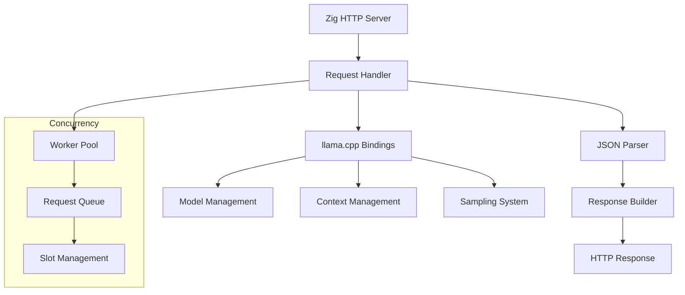

# Creating Your Own Server in Zig

## Overview

This document provides a comprehensive guide for creating a custom HTTP server in Zig that uses the llama.cpp library through the Zig bindings. This approach gives you complete control over the server implementation while leveraging the power and safety of Zig.

## Architecture



## Design Principles

### 1. Memory Safety
- Use Zig's memory management features
- Leverage allocators for controlled memory usage
- Implement proper error handling

### 2. Performance
- Efficient request handling with worker pools
- Optimized JSON parsing and serialization
- Minimal memory allocations

### 3. Extensibility
- Modular design for easy feature addition
- Plugin system for custom endpoints
- Configuration-driven behavior

## Step-by-Step Implementation

### Phase 1: Basic HTTP Server Foundation

#### 1.1 Project Structure

```
src/
├── main.zig              # Entry point
├── server.zig            # HTTP server implementation
├── handlers.zig          # Request handlers
├── models.zig            # Data models and types
├── llama_client.zig      # llama.cpp integration
├── json.zig              # JSON utilities
├── config.zig            # Configuration management
└── utils.zig             # Utility functions
```

#### 1.2 Basic HTTP Server

```zig
// src/server.zig
const std = @import("std");
const net = std.net;
const http = std.http;

pub const Server = struct {
    allocator: std.mem.Allocator,
    server: http.Server,
    llama_client: *LlamaClient,
    config: Config,
    
    pub fn init(allocator: std.mem.Allocator, config: Config) !*Server {
        const self = try allocator.create(Server);
        self.* = .{
            .allocator = allocator,
            .server = try http.Server.init(.{
                .kernel_backlog = 10,
                .reuse_address = true,
            }),
            .llama_client = try LlamaClient.init(allocator, config.llama),
            .config = config,
        };
        return self;
    }
    
    pub fn deinit(self: *Server) void {
        self.server.deinit();
        self.llama_client.deinit();
        self.allocator.destroy(self);
    }
    
    pub fn listen(self: *Server, address: net.Address) !void {
        try self.server.listen(address);
        std.log.info("Server listening on {}", .{address});
        
        while (true) {
            const response = try self.server.accept(.{});
            defer response.deinit();
            
            try self.handleRequest(response);
        }
    }
    
    fn handleRequest(self: *Server, response: *http.Server.Response) !void {
        const request = response.request;
        
        // Parse request
        const path = request.head.target;
        const method = request.head.method;
        
        // Route to appropriate handler
        if (std.mem.eql(u8, path, "/completion")) {
            try self.handleCompletion(response);
        } else if (std.mem.eql(u8, path, "/v1/chat/completions")) {
            try self.handleChatCompletion(response);
        } else if (std.mem.eql(u8, path, "/health")) {
            try self.handleHealth(response);
        } else {
            try self.handleNotFound(response);
        }
    }
};
```

#### 1.3 Request Handlers

```zig
// src/handlers.zig
const std = @import("std");
const json = std.json;
const http = std.http;

pub const Handlers = struct {
    pub fn handleCompletion(server: *Server, response: *http.Server.Response) !void {
        // Parse request body
        var body_reader = response.request.reader();
        var body_buffer: [4096]u8 = undefined;
        const body_len = try body_reader.read(&body_buffer);
        const body = body_buffer[0..body_len];
        
        // Parse JSON
        var parser = json.Parser.init(server.allocator);
        defer parser.deinit();
        
        const tree = try parser.parse(body);
        defer tree.deinit();
        
        // Extract parameters
        const prompt = tree.root.Object.get("prompt") orelse return error.MissingPrompt;
        const n_predict = tree.root.Object.get("n_predict") orelse 10;
        
        // Generate completion
        const result = try server.llama_client.complete(prompt.String, n_predict.Integer);
        
        // Build response
        try response.headers.append("Content-Type", "application/json");
        try response.headers.append("Access-Control-Allow-Origin", "*");
        
        try response.do();
        
        // Write JSON response
        const response_json = try std.fmt.allocPrint(
            server.allocator,
            \\{{"content": "{s}", "stop": true}}
        , .{result});
        defer server.allocator.free(response_json);
        
        try response.writer().writeAll(response_json);
    }
    
    pub fn handleChatCompletion(server: *Server, response: *http.Server.Response) !void {
        // Similar to handleCompletion but with chat-specific logic
        // Parse messages array and format as chat prompt
    }
    
    pub fn handleHealth(server: *Server, response: *http.Server.Response) !void {
        try response.headers.append("Content-Type", "application/json");
        try response.do();
        
        const health_json = 
            \\{"status": "healthy", "model_loaded": true}
        ;
        try response.writer().writeAll(health_json);
    }
    
    pub fn handleNotFound(server: *Server, response: *http.Server.Response) !void {
        response.status = .not_found;
        try response.headers.append("Content-Type", "application/json");
        try response.do();
        
        const error_json = 
            \\{"error": "Endpoint not found"}
        ;
        try response.writer().writeAll(error_json);
    }
};
```

### Phase 2: llama.cpp Integration

#### 2.1 LlamaClient Implementation

```zig
// src/llama_client.zig
const std = @import("std");
const llama = @import("llama");

pub const LlamaClient = struct {
    allocator: std.mem.Allocator,
    model: *llama.Model,
    context: *llama.Context,
    sampler: *llama.Sampler,
    config: LlamaConfig,
    
    pub const LlamaConfig = struct {
        model_path: []const u8,
        context_size: u32 = 4096,
        threads: u32 = 4,
        gpu_layers: i32 = 0,
    };
    
    pub fn init(allocator: std.mem.Allocator, config: LlamaConfig) !*LlamaClient {
        const self = try allocator.create(LlamaClient);
        
        // Initialize llama backend
        llama.Backend.init();
        llama.logSet(llama.utils.scopedLog, null);
        
        // Load model
        var mparams = llama.Model.defaultParams();
        mparams.n_gpu_layers = config.gpu_layers;
        const model = try llama.Model.initFromFile(config.model_path.ptr, mparams);
        
        // Create context
        var cparams = llama.Context.defaultParams();
        cparams.n_ctx = config.context_size;
        cparams.n_threads = config.threads;
        const context = try llama.Context.initWithModel(model, cparams);
        
        // Initialize sampler
        var sampler = llama.Sampler.initChain(.{ .no_perf = false });
        sampler.add(llama.Sampler.initGreedy());
        
        self.* = .{
            .allocator = allocator,
            .model = model,
            .context = context,
            .sampler = sampler,
            .config = config,
        };
        
        return self;
    }
    
    pub fn deinit(self: *LlamaClient) void {
        self.sampler.deinit();
        self.context.deinit();
        self.model.deinit();
        llama.Backend.deinit();
        self.allocator.destroy(self);
    }
    
    pub fn complete(self: *LlamaClient, prompt: []const u8, max_tokens: u32) ![]const u8 {
        const vocab = self.model.vocab() orelse return error.NoVocab;
        
        // Tokenize prompt
        var tokenizer = llama.Tokenizer.init(self.allocator);
        defer tokenizer.deinit();
        try tokenizer.tokenize(vocab, prompt, false, true);
        
        // Create batch
        var batch = llama.Batch.initOne(tokenizer.getTokens());
        
        // Generate response
        var result = std.ArrayList(u8).init(self.allocator);
        defer result.deinit();
        
        var detokenizer = llama.Detokenizer.init(self.allocator);
        defer detokenizer.deinit();
        
        for (0..max_tokens) |_| {
            try batch.decode(self.context);
            const token = self.sampler.sample(self.context, -1);
            
            if (vocab.isEog(token)) break;
            
            const text = try detokenizer.detokenize(vocab, token);
            try result.appendSlice(text);
            detokenizer.clearRetainingCapacity();
            
            // Prepare next batch
            var next_batch = llama.Batch.initOne(&.{token});
            batch = next_batch;
        }
        
        return result.toOwnedSlice();
    }
    
    pub fn chatComplete(self: *LlamaClient, messages: []const ChatMessage, max_tokens: u32) ![]const u8 {
        // Format messages as chat prompt
        const prompt = try self.formatChatPrompt(messages);
        return self.complete(prompt, max_tokens);
    }
    
    fn formatChatPrompt(self: *LlamaClient, messages: []const ChatMessage) ![]const u8 {
        var prompt = std.ArrayList(u8).init(self.allocator);
        defer prompt.deinit();
        
        for (messages) |message| {
            try prompt.appendSlice(message.role);
            try prompt.appendSlice(": ");
            try prompt.appendSlice(message.content);
            try prompt.appendSlice("\n");
        }
        
        try prompt.appendSlice("assistant: ");
        return prompt.toOwnedSlice();
    }
};
```

#### 2.2 Data Models

```zig
// src/models.zig
const std = @import("std");

pub const ChatMessage = struct {
    role: []const u8,
    content: []const u8,
};

pub const CompletionRequest = struct {
    prompt: []const u8,
    n_predict: u32 = 10,
    temperature: f32 = 0.7,
    top_p: f32 = 0.9,
    top_k: u32 = 40,
    stream: bool = false,
    stop: ?[]const []const u8 = null,
    
    pub fn fromJson(allocator: std.mem.Allocator, json: std.json.Value) !CompletionRequest {
        const obj = json.Object;
        return CompletionRequest{
            .prompt = obj.get("prompt") orelse return error.MissingPrompt,
            .n_predict = if (obj.get("n_predict")) |v| @intCast(v.Integer) else 10,
            .temperature = if (obj.get("temperature")) |v| @floatCast(v.Float) else 0.7,
            .top_p = if (obj.get("top_p")) |v| @floatCast(v.Float) else 0.9,
            .top_k = if (obj.get("top_k")) |v| @intCast(v.Integer) else 40,
            .stream = if (obj.get("stream")) |v| v.Bool else false,
            .stop = null, // TODO: implement stop sequences
        };
    }
};

pub const ChatCompletionRequest = struct {
    model: []const u8,
    messages: []const ChatMessage,
    max_tokens: u32 = 10,
    temperature: f32 = 0.7,
    stream: bool = false,
    
    pub fn fromJson(allocator: std.mem.Allocator, json: std.json.Value) !ChatCompletionRequest {
        const obj = json.Object;
        const messages_json = obj.get("messages") orelse return error.MissingMessages;
        
        var messages = std.ArrayList(ChatMessage).init(allocator);
        for (messages_json.Array.items) |msg_json| {
            const msg_obj = msg_json.Object;
            try messages.append(ChatMessage{
                .role = msg_obj.get("role") orelse return error.MissingRole,
                .content = msg_obj.get("content") orelse return error.MissingContent,
            });
        }
        
        return ChatCompletionRequest{
            .model = obj.get("model") orelse "default",
            .messages = messages.toOwnedSlice(),
            .max_tokens = if (obj.get("max_tokens")) |v| @intCast(v.Integer) else 10,
            .temperature = if (obj.get("temperature")) |v| @floatCast(v.Float) else 0.7,
            .stream = if (obj.get("stream")) |v| v.Bool else false,
        };
    }
};
```

### Phase 3: Advanced Features

#### 3.1 Streaming Support

```zig
// Add to src/handlers.zig
pub fn handleStreamingCompletion(server: *Server, response: *http.Server.Response) !void {
    // Parse request
    const request = try CompletionRequest.fromJson(server.allocator, parseRequestBody(response));
    defer request.deinit();
    
    if (!request.stream) {
        return handleCompletion(server, response);
    }
    
    // Setup streaming response
    try response.headers.append("Content-Type", "text/event-stream");
    try response.headers.append("Cache-Control", "no-cache");
    try response.headers.append("Connection", "keep-alive");
    try response.do();
    
    const writer = response.writer();
    
    // Stream tokens
    var tokenizer = llama.Tokenizer.init(server.allocator);
    defer tokenizer.deinit();
    try tokenizer.tokenize(server.llama_client.model.vocab() orelse return error.NoVocab, request.prompt, false, true);
    
    var batch = llama.Batch.initOne(tokenizer.getTokens());
    var detokenizer = llama.Detokenizer.init(server.allocator);
    defer detokenizer.deinit();
    
    for (0..request.n_predict) |i| {
        try batch.decode(server.llama_client.context);
        const token = server.llama_client.sampler.sample(server.llama_client.context, -1);
        
        if (server.llama_client.model.vocab() orelse return error.NoVocab).isEog(token) break;
        
        const text = try detokenizer.detokenize(server.llama_client.model.vocab() orelse return error.NoVocab, token);
        
        // Send SSE event
        const event = try std.fmt.allocPrint(
            server.allocator,
            "data: {{\"id\": \"{d}\", \"object\": \"text_completion\", \"created\": {d}, \"choices\": [{{\"text\": \"{s}\", \"index\": 0, \"logprobs\": null, \"finish_reason\": null}}]}}\n\n",
            .{ i, std.time.timestamp(), text }
        );
        defer server.allocator.free(event);
        
        try writer.writeAll(event);
        detokenizer.clearRetainingCapacity();
        
        // Prepare next batch
        var next_batch = llama.Batch.initOne(&.{token});
        batch = next_batch;
    }
    
    // Send completion event
    const done_event = "data: [DONE]\n\n";
    try writer.writeAll(done_event);
}
```

#### 3.2 Concurrency and Worker Pools

```zig
// src/worker_pool.zig
const std = @import("std");
const Thread = std.Thread;

pub const WorkerPool = struct {
    allocator: std.mem.Allocator,
    workers: []Thread,
    request_queue: std.fifo.LinearFifo(Request, .Dynamic),
    mutex: std.Thread.Mutex,
    condition: std.Thread.Condition,
    shutdown: bool,
    
    pub const Request = struct {
        id: u64,
        completion_request: CompletionRequest,
        response_channel: std.fifo.LinearFifo(Response, .Dynamic),
    };
    
    pub const Response = struct {
        id: u64,
        content: []const u8,
        error: ?[]const u8,
    };
    
    pub fn init(allocator: std.mem.Allocator, worker_count: u32) !*WorkerPool {
        const self = try allocator.create(WorkerPool);
        self.* = .{
            .allocator = allocator,
            .workers = try allocator.alloc(Thread, worker_count),
            .request_queue = std.fifo.LinearFifo(Request, .Dynamic).init(allocator),
            .mutex = .{},
            .condition = .{},
            .shutdown = false,
        };
        
        // Start worker threads
        for (0..worker_count) |i| {
            self.workers[i] = try Thread.spawn(.{}, workerLoop, .{self});
        }
        
        return self;
    }
    
    pub fn deinit(self: *WorkerPool) void {
        // Signal shutdown
        self.mutex.lock();
        self.shutdown = true;
        self.condition.signal();
        self.mutex.unlock();
        
        // Wait for workers
        for (self.workers) |worker| {
            worker.join();
        }
        
        self.request_queue.deinit();
        self.allocator.free(self.workers);
        self.allocator.destroy(self);
    }
    
    pub fn submitRequest(self: *WorkerPool, request: Request) !void {
        self.mutex.lock();
        defer self.mutex.unlock();
        
        try self.request_queue.writeItem(request);
        self.condition.signal();
    }
    
    fn workerLoop(self: *WorkerPool) void {
        while (true) {
            self.mutex.lock();
            
            while (self.request_queue.count() == 0 and !self.shutdown) {
                self.condition.wait(&self.mutex);
            }
            
            if (self.shutdown) {
                self.mutex.unlock();
                break;
            }
            
            const request = self.request_queue.readItem() orelse {
                self.mutex.unlock();
                continue;
            };
            
            self.mutex.unlock();
            
            // Process request
            const response = self.processRequest(request.completion_request);
            
            // Send response
            request.response_channel.writeItem(.{
                .id = request.id,
                .content = response.content,
                .error = response.error,
            }) catch {};
        }
    }
    
    fn processRequest(self: *WorkerPool, req: CompletionRequest) Response {
        // Implementation would use llama_client to process the request
        _ = self;
        _ = req;
        return .{ .id = 0, .content = "", .error = "Not implemented" };
    }
};
```

#### 3.3 Configuration Management

```zig
// src/config.zig
const std = @import("std");
const json = std.json;

pub const Config = struct {
    server: ServerConfig,
    llama: LlamaConfig,
    logging: LoggingConfig,
    
    pub const ServerConfig = struct {
        host: []const u8 = "127.0.0.1",
        port: u16 = 8080,
        max_connections: u32 = 100,
        request_timeout: u32 = 30,
    };
    
    pub const LlamaConfig = struct {
        model_path: []const u8,
        context_size: u32 = 4096,
        threads: u32 = 4,
        gpu_layers: i32 = 0,
        batch_size: u32 = 512,
    };
    
    pub const LoggingConfig = struct {
        level: std.log.Level = .info,
        enable_console: bool = true,
        enable_file: bool = false,
        log_file: ?[]const u8 = null,
    };
    
    pub fn loadFromFile(allocator: std.mem.Allocator, path: []const u8) !Config {
        const file = try std.fs.cwd().openFile(path, .{});
        defer file.close();
        
        const content = try file.readToEndAlloc(allocator, std.math.maxInt(usize));
        defer allocator.free(content);
        
        var parser = json.Parser.init(allocator);
        defer parser.deinit();
        
        const tree = try parser.parse(content);
        defer tree.deinit();
        
        return try fromJson(allocator, tree.root);
    }
    
    pub fn fromJson(allocator: std.mem.Allocator, json_value: json.Value) !Config {
        const obj = json_value.Object;
        
        return Config{
            .server = if (obj.get("server")) |v| try ServerConfig.fromJson(allocator, v) else .{},
            .llama = if (obj.get("llama")) |v| try LlamaConfig.fromJson(allocator, v) else .{},
            .logging = if (obj.get("logging")) |v| try LoggingConfig.fromJson(allocator, v) else .{},
        };
    }
};
```

### Phase 4: Main Application

```zig
// src/main.zig
const std = @import("std");
const Server = @import("server.zig").Server;
const Config = @import("config.zig").Config;

pub fn main() !void {
    // Initialize allocator
    var gpa = std.heap.GeneralPurposeAllocator(.{}){};
    defer if (gpa.deinit() != .ok) @panic("memory leak detected");
    const allocator = gpa.allocator();
    
    // Load configuration
    const config = try Config.loadFromFile(allocator, "config.json");
    
    // Setup logging
    try setupLogging(config.logging);
    
    // Create server
    const server = try Server.init(allocator, config);
    defer server.deinit();
    
    // Parse address
    const address = try std.net.Address.parseIp(config.server.host, config.server.port);
    
    // Start server
    try server.listen(address);
}

fn setupLogging(config: Config.LoggingConfig) !void {
    if (config.enable_console) {
        try std.log.scoped(.server).info("Starting server...", .{});
    }
    
    if (config.enable_file) {
        if (config.log_file) |log_file| {
            // Setup file logging
            _ = log_file;
        }
    }
}
```

## Configuration File Example

```json
{
  "server": {
    "host": "127.0.0.1",
    "port": 8080,
    "max_connections": 100,
    "request_timeout": 30
  },
  "llama": {
    "model_path": "models/llama-2-7b-chat.Q4_K_M.gguf",
    "context_size": 4096,
    "threads": 8,
    "gpu_layers": 35,
    "batch_size": 512
  },
  "logging": {
    "level": "info",
    "enable_console": true,
    "enable_file": false
  }
}
```

## Testing

### Unit Tests

```zig
// src/handlers_test.zig
const std = @import("std");
const testing = std.testing;

test "parse completion request" {
    const json_str = 
        \\{"prompt": "Hello, world!", "n_predict": 10, "temperature": 0.7}
    ;
    
    var parser = std.json.Parser.init(testing.allocator);
    defer parser.deinit();
    
    const tree = try parser.parse(json_str);
    defer tree.deinit();
    
    const request = try CompletionRequest.fromJson(testing.allocator, tree.root);
    defer request.deinit();
    
    try testing.expectEqualStrings("Hello, world!", request.prompt);
    try testing.expectEqual(@as(u32, 10), request.n_predict);
    try testing.expectEqual(@as(f32, 0.7), request.temperature);
}
```

### Integration Tests

```zig
// tests/integration_test.zig
const std = @import("std");
const testing = std.testing;
const net = std.net;

test "server responds to completion request" {
    // Start server in background
    const server_thread = try std.Thread.spawn(.{}, startTestServer, .{});
    defer server_thread.join();
    
    // Wait for server to start
    std.time.sleep(100 * std.time.ns_per_ms);
    
    // Send request
    const address = try net.Address.parseIp("127.0.0.1", 8080);
    const stream = try net.tcpConnectToAddress(address);
    defer stream.close();
    
    const request = 
        \\POST /completion HTTP/1.1\r
        \\Host: localhost:8080\r
        \\Content-Type: application/json\r
        \\Content-Length: 35\r
        \\\r
        \\{"prompt": "Hello", "n_predict": 5}
    ;
    
    try stream.writeAll(request);
    
    // Read response
    var buffer: [1024]u8 = undefined;
    const bytes_read = try stream.read(&buffer);
    const response = buffer[0..bytes_read];
    
    try testing.expect(std.mem.indexOf(u8, response, "HTTP/1.1 200") != null);
    try testing.expect(std.mem.indexOf(u8, response, "application/json") != null);
}
```

## Performance Optimization

### 1. Memory Pool Management

```zig
// src/memory_pool.zig
const std = @import("std");

pub const MemoryPool = struct {
    allocator: std.mem.Allocator,
    pools: std.AutoHashMap(usize, std.ArrayList([]u8)),
    
    pub fn init(allocator: std.mem.Allocator) MemoryPool {
        return .{
            .allocator = allocator,
            .pools = std.AutoHashMap(usize, std.ArrayList([]u8)).init(allocator),
        };
    }
    
    pub fn deinit(self: *MemoryPool) void {
        var it = self.pools.iterator();
        while (it.next()) |entry| {
            for (entry.value_ptr.items) |buffer| {
                self.allocator.free(buffer);
            }
            entry.value_ptr.deinit();
        }
        self.pools.deinit();
    }
    
    pub fn getBuffer(self: *MemoryPool, size: usize) ![]u8 {
        const pool = self.pools.get(size) orelse {
            var new_pool = std.ArrayList([]u8).init(self.allocator);
            try self.pools.put(size, new_pool);
            return try self.allocator.alloc(u8, size);
        };
        
        if (pool.items.len > 0) {
            return pool.orderedRemove(0);
        }
        
        return try self.allocator.alloc(u8, size);
    }
    
    pub fn returnBuffer(self: *MemoryPool, buffer: []u8) void {
        const pool = self.pools.get(buffer.len) orelse return;
        pool.append(buffer) catch {};
    }
};
```

### 2. Connection Pooling

```zig
// src/connection_pool.zig
const std = @import("std");
const net = std.net;

pub const ConnectionPool = struct {
    allocator: std.mem.Allocator,
    connections: std.ArrayList(net.Stream),
    mutex: std.Thread.Mutex,
    
    pub fn init(allocator: std.mem.Allocator) ConnectionPool {
        return .{
            .allocator = allocator,
            .connections = std.ArrayList(net.Stream).init(allocator),
            .mutex = .{},
        };
    }
    
    pub fn deinit(self: *ConnectionPool) void {
        self.mutex.lock();
        defer self.mutex.unlock();
        
        for (self.connections.items) |conn| {
            conn.close();
        }
        self.connections.deinit();
    }
    
    pub fn getConnection(self: *ConnectionPool, address: net.Address) !net.Stream {
        self.mutex.lock();
        defer self.mutex.unlock();
        
        if (self.connections.items.len > 0) {
            return self.connections.orderedRemove(0);
        }
        
        return try net.tcpConnectToAddress(address);
    }
    
    pub fn returnConnection(self: *ConnectionPool, conn: net.Stream) void {
        self.mutex.lock();
        defer self.mutex.unlock();
        
        self.connections.append(conn) catch {
            conn.close();
        };
    }
};
```

## Deployment

### 1. Build Script

```zig
// build.zig
const std = @import("std");

pub fn build(b: *std.Build) !void {
    const target = b.standardTargetOptions(.{});
    const optimize = b.standardOptimizeOption(.{});
    
    const exe = b.addExecutable(.{
        .name = "llama-server-zig",
        .root_source_file = .{ .path = "src/main.zig" },
        .target = target,
        .optimize = optimize,
    });
    
    // Add llama.cpp dependency
    const llama_module = b.addModule("llama", .{
        .source_file = .{ .path = "llama.cpp.zig/llama.zig" },
    });
    exe.addModule("llama", llama_module);
    
    b.installArtifact(exe);
    
    // Add run step
    const run_cmd = b.addRunArtifact(exe);
    run_cmd.step.dependOn(b.getInstallStep());
    if (b.args) |args| {
        run_cmd.addArgs(args);
    }
    
    const run_step = b.step("run", "Run the server");
    run_step.dependOn(&run_cmd.step);
}
```

### 2. Docker Support

```dockerfile
# Dockerfile
FROM alpine:latest

# Install dependencies
RUN apk add --no-cache zig

# Copy source code
COPY . /app
WORKDIR /app

# Build the application
RUN zig build -Doptimize=ReleaseFast

# Create runtime directory
RUN mkdir -p /app/runtime

# Copy model and config
COPY models/ /app/runtime/models/
COPY config.json /app/runtime/

# Expose port
EXPOSE 8080

# Run the server
CMD ["/app/zig-out/bin/llama-server-zig"]
```

### 3. Systemd Service

```ini
# /etc/systemd/system/llama-server-zig.service
[Unit]
Description=Llama Server Zig
After=network.target

[Service]
Type=simple
User=llama
WorkingDirectory=/opt/llama-server-zig
ExecStart=/opt/llama-server-zig/llama-server-zig
Restart=always
RestartSec=10

[Install]
WantedBy=multi-user.target
```

## Monitoring and Metrics

### 1. Health Endpoints

```zig
// Add to handlers.zig
pub fn handleMetrics(server: *Server, response: *http.Server.Response) !void {
    const metrics = server.llama_client.getMetrics();
    
    try response.headers.append("Content-Type", "application/json");
    try response.do();
    
    const metrics_json = try std.fmt.allocPrint(
        server.allocator,
        \\{{"requests_total": {d}, "requests_active": {d}, "avg_response_time": {d:.2}, "memory_usage": {d}}}
    , .{ metrics.requests_total, metrics.requests_active, metrics.avg_response_time, metrics.memory_usage });
    defer server.allocator.free(metrics_json);
    
    try response.writer().writeAll(metrics_json);
}
```

### 2. Logging

```zig
// Add structured logging
const log = std.log.scoped(.llama_server);

log.info("Request received", .{
    .method = request.head.method,
    .path = request.head.target,
    .user_agent = request.headers.getFirstValue("user-agent"),
    .content_length = request.headers.getFirstValue("content-length"),
});
```

## Conclusion

This custom Zig server implementation provides:

- **Complete Control**: Full control over server behavior and features
- **Memory Safety**: Leverages Zig's memory safety features
- **Performance**: Optimized for high-throughput scenarios
- **Extensibility**: Easy to add new endpoints and features
- **Type Safety**: Compile-time guarantees for data structures
- **Cross-Platform**: Works on all platforms supported by Zig

The implementation can be extended with additional features like:
- Authentication and authorization
- Rate limiting
- Caching layers
- Load balancing
- Metrics collection
- Plugin system

This approach is ideal for applications that need custom server behavior or want to integrate LLM capabilities into existing Zig applications.
